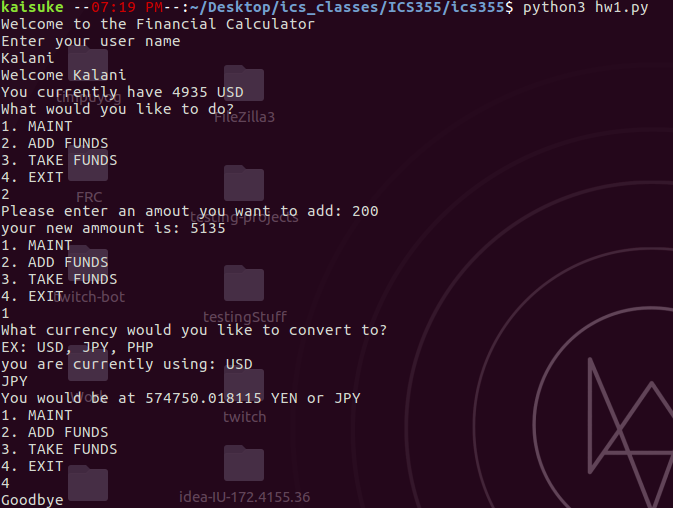

# ics355 Homework

Working in python since i wanted more of a challenge since i have worked in C, Java,
C++, etc.

but none of the classes here at UH Manoa has taught python.

This will be utilizing the powers of Python 3.

Before we start anything, we need to import some libraries for this project.
we will be installing one library in particular. it is called passlib.

The library uses the PBKDF2 Hashing function

An example of the hash looks like

```
$pbkdf2-sha256$6400$.6UI/S.nXIk8jcbdHx3Fhg$98jZicV16ODfEsEZeYPGHU3kbrUrvUEXOPimVSQDD44
```

*** or ***
```
$pbkdf2-digest$rounds$salt$checksum
```
---
To install the library
```
pip3 install passlib
```
*** or ***
```
pip install passlib
```

To start it you you have to enter
```
python3 hw1.py
```

and then you are prompted to do the following. making graphical graphics to this will just be utter nonsense.

we will assume that we have no need for currency symbols since the Philippine peso and the Mexian peso are the same symbol and can be confused by each other.

We will be using the universal meaning to each currency:
+ USD (US dollars)
+ JPY (Japanese Yen)
+ PHP (Philippine Peso)

Here i will give some screen captures of the service


this is a small example of the code.

as you can see there is 4 choices to choose from.
+ MAINT
+ ADD FUNDS
+ TAKE FUNDS
+ EXIT

MAINT is basically the conversion. it takes your bank account and it shows the conversion of what you give it.

ADD FUNDS self explainitory

TAKE FUNDS self explainitory

EXIT self explainitory
